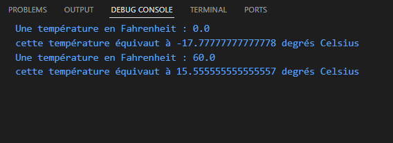
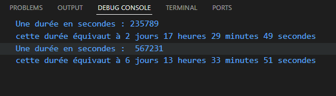
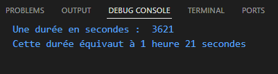
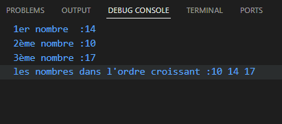
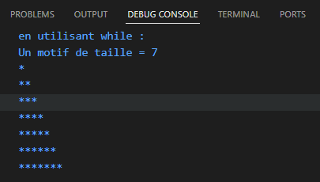
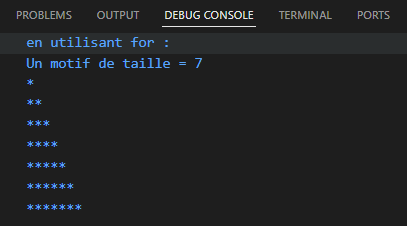
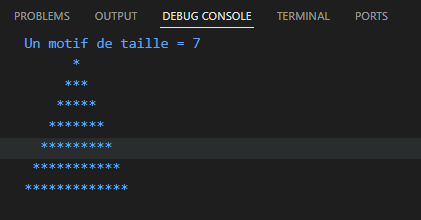
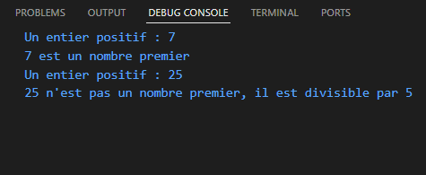
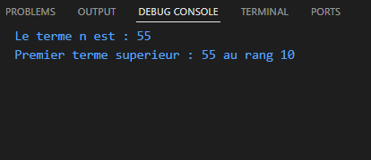
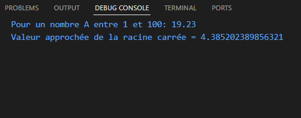

# TD n°4 — Introduction à JavaScript

## 🎓 Cadre Académique

| | |
|---|---|
| **Établissement** | Université Hassan II de Casablanca – ENSET Mohammedia |
| **Master** | SDIA (Systèmes de Données & Intelligence Artificielle) |
| **Module** |Technologies du Web & Web Sémantique |
| **Encadrant** |Pr. Oumayma AGHERAI |
|**Étudiant :** |Mustapha Elmifdali|
| **Année universitaire** | 2025–2026 |

> **Objectifs :** Expérimenter les constructions de base du langage JavaScript (types simples, déclarations de variables, instructions de contrôle, itérations) qui sont très proches syntaxiquement de celles utilisées par le langage C.

---

## Table des matières

- [Exercice 1 — Conversion de températures](#exercice-1--conversion-de-températures)
- [Exercice 2 — Conversion de durées](#exercice-2--conversion-de-durées)
- [Exercice 2-bis — Conversion de durées améliorée](#exercice-2-bis--conversion-de-durées-améliorée)
- [Exercice 3 — Classer 3 nombres](#exercice-3--classer-3-nombres)
- [Exercice 4 — Affichage de motifs (triangle while)](#exercice-4--affichage-de-motifs--triangle-while)
- [Exercice 4 (for) — Affichage de motifs (triangle for)](#exercice-4-for--affichage-de-motifs--triangle-for)
- [Exercice 4-bis — Pyramide](#exercice-4-bis--pyramide)
- [Exercice 5 — Nombre premier](#exercice-5--nombre-premier)
- [Exercice 6 — Suite de Fibonacci](#exercice-6--suite-de-fibonacci)
- [Exercice 7 — Racine carrée approchée](#exercice-7--racine-carrée-approchée)

---

## Exercice 1 — Conversion de températures

**Description :** Écrire une fonction `degreC` qui affiche la valeur en degrés Celsius d'une température exprimée en degrés Fahrenheit, en utilisant la formule :

```
tempC = (5/9) × (tempF − 32)
```

**Code — `ex1.html`**

```html
<!doctype html>
<html lang="en">
  <head>
    <meta charset="UTF-8" />
    <meta name="viewport" content="width=device-width, initial-scale=1.0" />
    <title>Javascript tp</title>
  </head>
  <body>
    <script>
      function degreC(tempF) {
        let tempC = (5 / 9) * (tempF - 32);
        console.log(
          "cette température équivaut à " + tempC + " degrés Celsius",
        );
      }
      console.log("Une température en Fahrenheit : 0.0");
      degreC(0);
      console.log("Une température en Fahrenheit : 60.0");
      degreC(60);
    </script>
  </body>
</html>
```

**Screenshot :**



---

## Exercice 2 — Conversion de durées

**Description :** Écrire une fonction `hjms` qui, pour un nombre de secondes donné, calcule et renvoie son équivalent en jours, heures, minutes et secondes.

**Code — `ex2.html`**

```html
<script>
    function hjms(secondes) {

    let jours = Math.floor(secondes / 86400);
    secondes = secondes % 86400;

    let heures = Math.floor(secondes / 3600);
    secondes = secondes % 3600;

    let minutes = Math.floor(secondes / 60);
    secondes = secondes % 60;

    console.log("cette durée équivaut à " + jours + " jours " +
        heures + " heures " +
        minutes + " minutes " +
        secondes + " secondes");
}
console.log('Une durée en secondes : 235789')
hjms(235789);
console.log('Une durée en secondes :  567231')
hjms(567231);
</script>
```

**Screenshot :**



---

## Exercice 2-bis — Conversion de durées améliorée

**Description :** Améliorer la fonction `hjms` de sorte que :
- Les valeurs nulles n'apparaissent pas dans l'affichage.
- Si une valeur est égale à 1, l'unité est affichée au singulier (sans **s**).

**Code — `ex2-bis.html`**

```html
<script>
    function hjms2(s) {

    let jours = Math.floor(s / 86400);
    s %= 86400;

    let heures = Math.floor(s / 3600);
    s %= 3600;

    let minutes = Math.floor(s / 60);
    s %= 60;

    let resultat = "";

    if (jours > 0)
        resultat += jours + (jours == 1 ? " jour " : " jours ");

    if (heures > 0)
        resultat += heures + (heures == 1 ? " heure " : " heures ");

    if (minutes > 0)
        resultat += minutes + (minutes == 1 ? " minute " : " minutes ");

    if (s > 0)
        resultat += s + (s == 1 ? " seconde" : " secondes");

    console.log("Cette durée équivaut à " + resultat);
}

console.log('Une durée en secondes :  3621')
hjms2(3621);
</script>
```

**Screenshot :**



---

## Exercice 3 — Classer 3 nombres

**Description :** Écrire un programme `troisNombres` qui renvoie l'ordre croissant (du plus petit au plus grand) de 3 nombres saisis par l'utilisateur.

**Code — `ex3.html`**

```html
<script>
  var a = parseFloat(prompt("1er nombre : "));
  var b = parseFloat(prompt("2ème nombre : "));
  var c = parseFloat(prompt("3ème nombre : "));

  var premier, deuxieme, troisieme;
  function troisNombres() {
    if (a <= b && a <= c) {
      premier = a;
      if (b <= c) {
        deuxieme = b;
        troisieme = c;
      } else {
        deuxieme = c;
        troisieme = b;
      }
    } else if (b <= a && b <= c) {
      premier = b;
      if (a <= c) {
        deuxieme = a;
        troisieme = c;
      } else {
        deuxieme = c;
        troisieme = a;
      }
    } else {
      premier = c;
      if (a <= b) {
        deuxieme = a;
        troisieme = b;
      } else {
        deuxieme = b;
        troisieme = a;
      }
    }

    console.log(
      "les nombres dans l'ordre croissant :" +
        premier +
        " " +
        deuxieme +
        " " +
        troisieme,
    );
  }
  console.log("1er nombre  :" + a);
  console.log("2ème nombre :" + b);
  console.log("3ème nombre :" + c);
  troisNombres();
</script>
```

**Screenshot :**



---

## Exercice 4 — Affichage de motifs : Triangle (while)

**Description :** Écrire une fonction `triangle1` affichant un motif triangulaire en utilisant uniquement des instructions `while`.

**Code — `ex4.html`**

```html
<!DOCTYPE html>
<html lang="en">
<head>
    <meta charset="UTF-8">
    <meta name="viewport" content="width=device-width, initial-scale=1.0">
    <title>Document</title>
</head>
<body>
    <script>
        function triangle1(taille) {
    let i = 1;

    while (i <= taille) {
        let j = 1;
        let ligne = "";

        while (j <= i) {
            ligne += "*";
            j++;
        }

        console.log(ligne);
        i++;
    }
}

let taille = 7;
console.log("en utilisant while :")
console.log("Un motif de taille =", taille);
triangle1(taille);
    </script>
</body>
</html>
```

**Screenshot :**



---

## Exercice 4 (for) — Affichage de motifs : Triangle (for)

**Description :** Écrire une fonction `triangle2` affichant le même motif triangulaire en utilisant uniquement des instructions `for`.

**Code — `ex4for.html`**

```html
<script>
    function triangle2(taille) {
    for (let i = 1; i <= taille; i++) {
        let ligne = "";

        for (let j = 1; j <= i; j++) {
            ligne += "*";
        }

        console.log(ligne);
    }
}

let taille = 7;
console.log("en utilisant for :")
console.log("Un motif de taille =", taille);
triangle2(taille);
</script>
```

**Screenshot :**



---

## Exercice 4-bis — Pyramide

**Description :** Afficher non plus un triangle mais une pyramide centrée dont la taille est fixée par l'utilisateur.

**Code — `ex4-bis.html`**

```html
<script>
    function pyramide(taille) {

    for (let i = 1; i <= taille; i++) {

        let espaces = " ".repeat(taille - i);
        let etoiles = "*".repeat(2*i - 1);

        console.log(espaces + etoiles);
    }
}
taille=7
console.log("Un motif de taille =", taille);
pyramide(taille);
</script>
```

**Screenshot :**



---

## Exercice 5 — Nombre premier

**Description :** Écrire un programme `premier` qui teste si un nombre introduit par l'utilisateur est premier ou non. Un nombre est premier s'il n'a que deux diviseurs : 1 et lui-même.

**Code — `ex5.html`**

```html
<script>
  function premier(n) {
    if (n < 2) {
      console.log(n + " n'est pas un nombre premier");
      return;
    }

    for (let i = 2; i <= Math.sqrt(n); i++) {
      if (n % i === 0) {
        console.log(
          n + " n'est pas un nombre premier, il est divisible par " + i,
        );
        return;
      }
    }

    console.log(n + " est un nombre premier");
  }

  console.log("Un entier positif : 7");
  premier(7);

  console.log("Un entier positif : 25");
  premier(25);
</script>
```

**Screenshot :**



---

## Exercice 6 — Suite de Fibonacci

**Description :** La suite de Fibonacci est définie par :

```
F₀ = 0,  F₁ = 1,  Fₙ₊₂ = Fₙ₊₁ + Fₙ
```

- **`fibo1(n)`** — Calcule le n-ième terme de la suite.
- **`fibo2(valeur)`** — Trouve la valeur et le rang du premier terme supérieur à une valeur donnée.

**Code — `ex6.html`**

```html
<script>
  function fibo1(n) {
    let u0 = 0;
    let u1 = 1;

    if (n == 0) return u0;
    if (n == 1) return u1;

    for (let i = 2; i <= n; i++) {
      let u = u0 + u1;
      u0 = u1;
      u1 = u;
    }

    console.log("Le terme n est :", u1);
  }
  function fibo2(valeur) {
    let u0 = 0;
    let u1 = 1;
    let rang = 1;

    while (u1 <= valeur) {
      let u = u0 + u1;
      u0 = u1;
      u1 = u;
      rang++;
    }

    console.log("Premier terme superieur :", u1, "au rang", rang);
  }

  fibo1(10);
  fibo2(50);
</script>
```

**Screenshot :**



---

## Exercice 7 — Racine carrée approchée

**Description :** Calculer une valeur approchée de √A en utilisant la suite définie par récurrence :

```
u₀ = A/2,   uₙ₊₁ = ½ × (uₙ + A/uₙ)
```

On cherche le premier terme `uₙ` tel que `|uₙ² − A| < 10⁻⁵`.

**Code — `ex7.html`**

```html
<script>
    function raca1(A) {

    let u = A / 2;

    while (Math.abs(u*u - A) > 0.00001) {
        u = 0.5 * (u + A/u);
    }

    console.log("Valeur approchée de la racine carrée = " + u);
}

let A = 19.23;

console.log("Pour un nombre A entre 1 et 100:", A);
raca1(A);
</script>
```

**Screenshot :**



---

## Structure du projet

```
TP03/
├── ex1.html          # Exercice 1  — Conversion de températures
├── ex2.html          # Exercice 2  — Conversion de durées
├── ex2-bis.html      # Exercice 2-bis — Durées améliorée (singulier/zéros)
├── ex3.html          # Exercice 3  — Tri de 3 nombres
├── ex4.html          # Exercice 4  — Triangle (while)
├── ex4for.html       # Exercice 4  — Triangle (for)
├── ex4-bis.html      # Exercice 4-bis — Pyramide
├── ex5.html          # Exercice 5  — Nombre premier
├── ex6.html          # Exercice 6  — Suite de Fibonacci
├── ex7.html          # Exercice 7  — Racine carrée approchée
├── screenshots/
│   ├── ex1.png
│   ├── ex2.png
│   ├── ex2-bis.png
│   ├── ex3.png
│   ├── ex4while.png
│   ├── ex4for.png
│   ├── ex4-bis.png
│   ├── ex5.png
│   ├── ex6.png
│   └── ex7.png
└── README.md
```